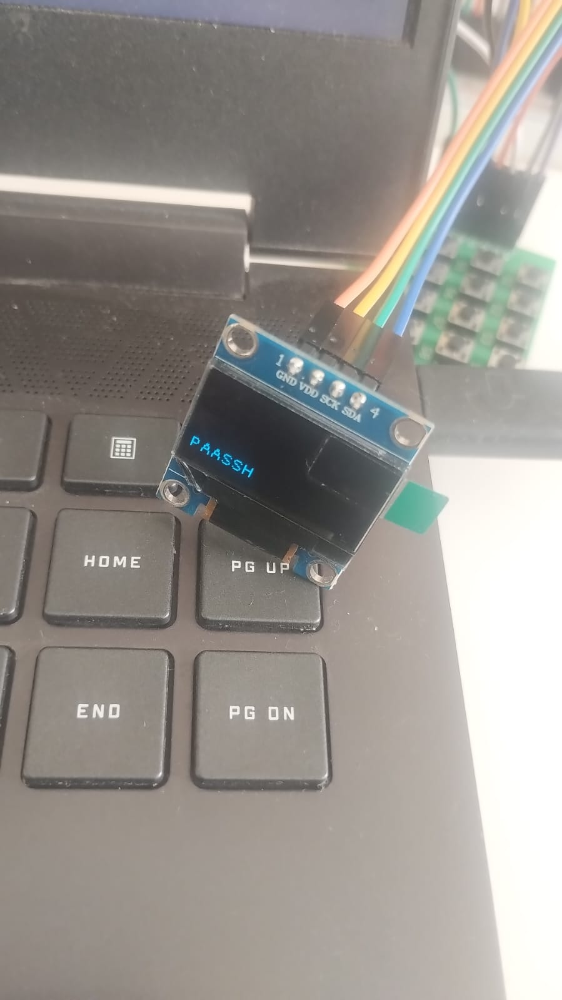
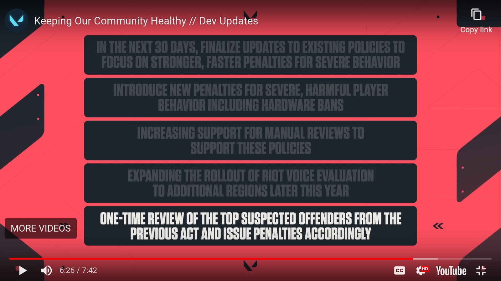

# May 24
> May-be I missed April - progress on making dumbphone, playing 3d chess with valorant't text chat ban filter

[TOC]

## Progress on making my own dumbphone: keyboards, oleds and fonts
I put a small 4x4 keyboard on the thing, and then put a small 128x64 oled and then spent another month making it work, cause I had to order resistors as the oled used I2C protocol which requires pull up connections between peripherals and I never thought of that mygod. Then I spent more time on figuring out the I2C address of the oled device, cause this one didn't have it printed on the pcb :cry:. It was magic when I finally got it working.

### Adding bitmap fonts for the phone
OH MY GOODDDDD~ Bitmap fonts are DEAD. THEY KILLED BITMAP FONTS>. NO PCF PARSERS GOD HELP> FONTS WERE'NT SUPPOSED TO BE THIS HARD!? IT IS SO BIZZARE, EVERYTHING I STUMBLE UPON IS ATLEAST 7 YEARS OLD> THE <a href="https://github.com/ganaware/pcf2bdf">SOLUTION</a> THAT WORKED IS OLDER THAN ME !!

Bitmap fonts are basically fonts stored in an array. A 1 means the pixel is lit and 0 means pixel is dark. As you can imagine these fonts date back to when computing was first started, and many of the classic fonts are from very old pc's(before I was born). Also many of these fonts are in formats whose parsers and specifications are long lost to time. So If your faviorate font was not in the format that you can parse, you just have to make it by hand in a newer format. The problem is that newer fonts are not bitmap fonts, they are vector based. This means they use math to draw/construct the font.

I wanted this <a href="https://github.com/bluescan/proggyfonts">font</a>. After trying to download and use a large count of archaic parsers, converters,etc. I finally managed to extract a simple array for all characters. This I finally copied in my c code as a 2d array.

### Playing 3D chess with valorant's text chat ban filter
I think cursing in a video game (at least text chat) is part of the experience for some games. It's not that I like toxicity or I am fond of swearing excesively in video games. But when an oponent is clearly cheating / smurfing, it just feels good to get your anger off the chest.So, Ladies and gentlemen, through my months of hard work and research I present to you, a list of words , try and guess if typing the word in chat will ban you. Please explore the beautiful valorant chat window i recreated for your pleasure.

* Sex: No, this will not ban you.
* Niger: No, this will not ban you. It's amazing that this is allowed, its due to the grace of a country having the same name.
* nig: Yes, this will ban you. 
* Retarded: yes this will ban you.Come on, they are not retarded.
* retards: No this word will not ban you. they are retards.
* fuck: No, this will not ban you, for some reason.
* shit: NO
* cunt: no
* s p a c e separated bannable words: Yes this will get you banned. Makes me wonder what kind of algorithm they are running.
* KILL YOURSELF: No this will not get you banned.
* kys: This will get you banned.

So, YALL ARE RETARDS KILL YOURSELF Niger -> Won't get you banned in valorant

Update: This guide is no longer valid. 

Plus, according to the highlighted point, I might get banned :skull:
