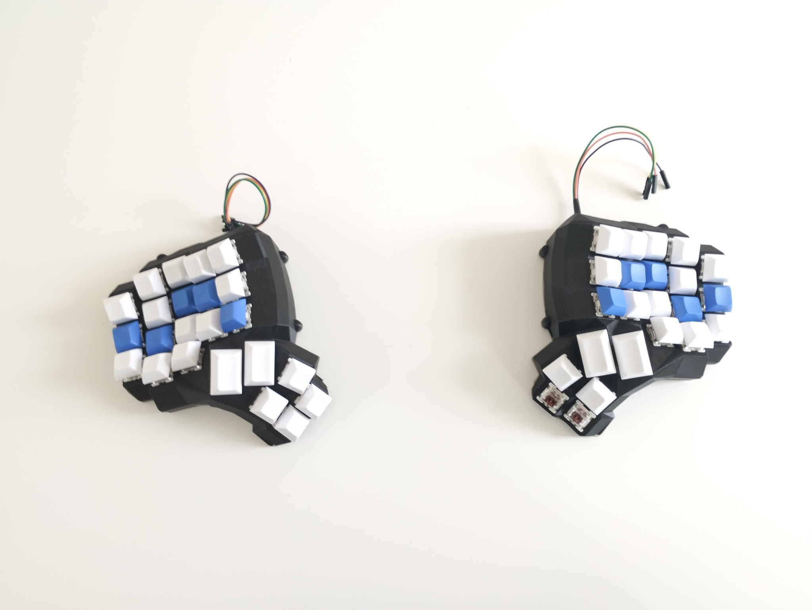
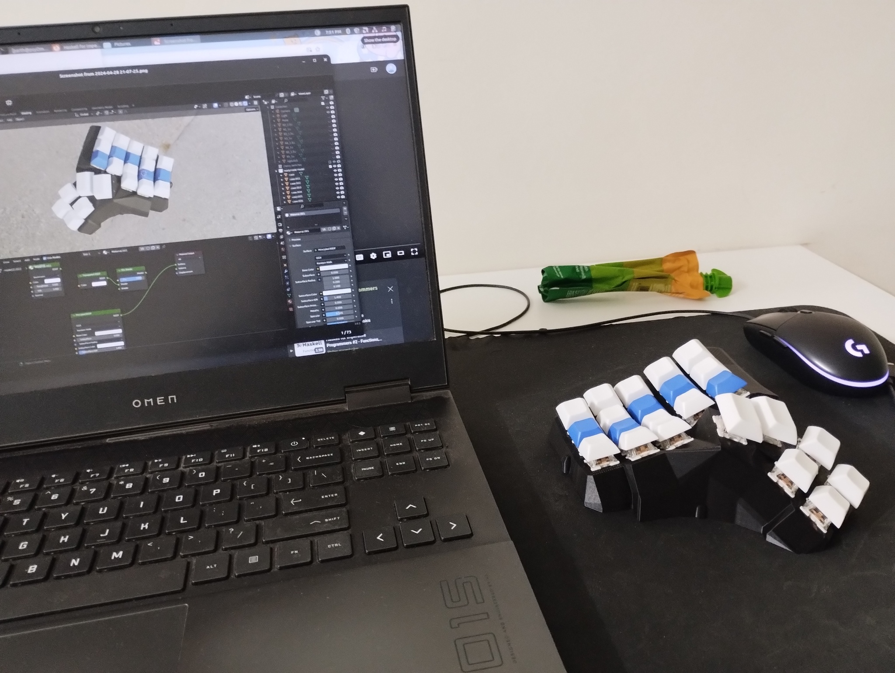
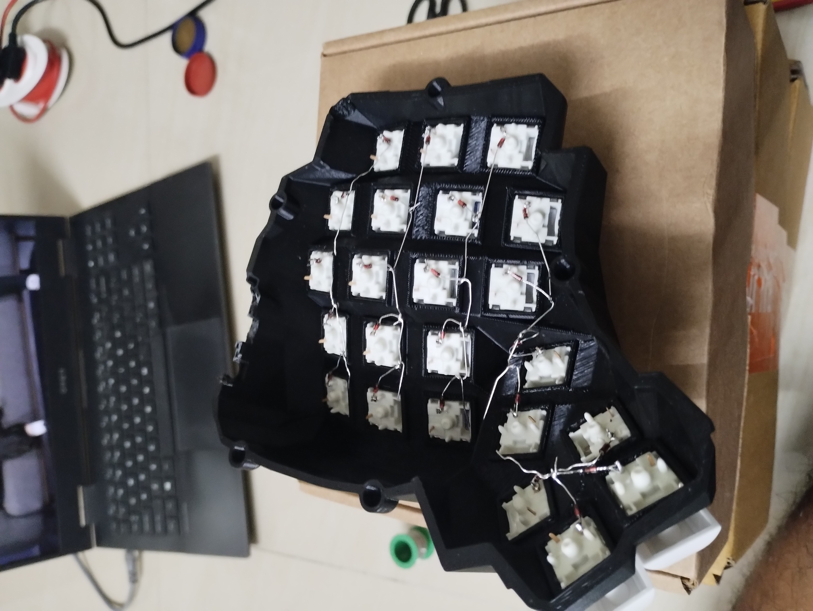
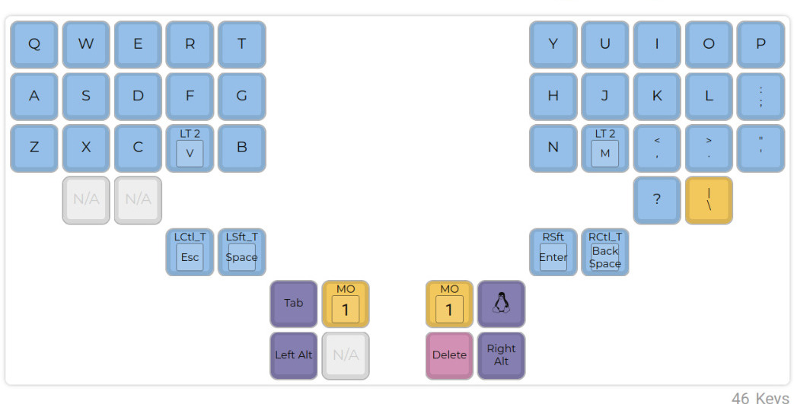
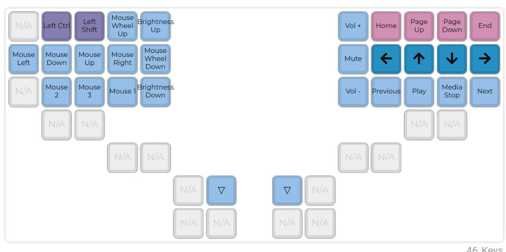
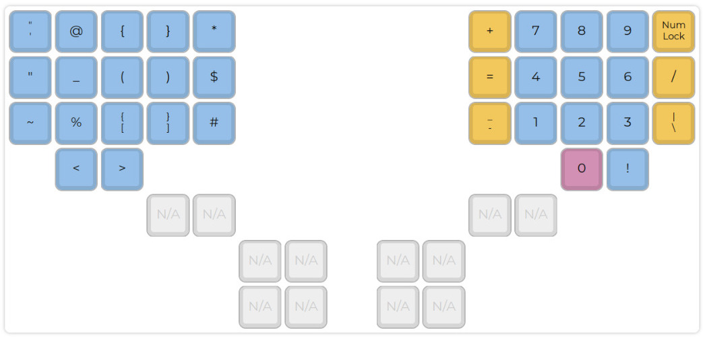

# Building a dactyl-manuform
> I made a crazy ergonomic 3d printed keyboard

[TOC]

## I made a crazy ergonomic 3d printed keyboard :
> 26th May, 2024
<blockquote class="twitter-tweet">
i&#39;m concerned that if programmers can 3d print their own keyboards then all productivity will halt for a period of at least five years
&mdash; Paul Ford (@ftrain) <a href="https://twitter.com/ftrain/status/577205992406065152?ref_src=twsrc%5Etfw">March 15, 2015</a></blockquote>  
The Dactyl Manuform is an open source keyboard on <a href = "https://github.com/abstracthat/dactyl-manuform">github</a>.
It is split into two halves, and it has multiple thumb keys. I finished making mine just last week. 

 
And it went just as planned...

 
Here's how you can make one:

- Generate the .stl(3d files for the case) for the dactyl manuform from this <a href='https://ryanis.cool/dactyl/#manuform:Ch0IBRAEGgNzaXgiA3R3byoDYm94MgZub3JtaWU4ABIQCMYKEKMFGMIDIAMoxgowACIXVQAAEEEYACABXQAAYEBlAAAgQEAASAAy+QGVAwAAIECdAwAAgD+AAwGIAwENAAAAABUAAAAAHeF6NEAlAACQwC0AAEDBNeF6tEA9AAAAAEUAAAAATQAAwEBVAABAwF0AAOBAZTMzYcJtMzMtwnUAALzBeOcCgAHNGIgByCSVATMzF8KdATMzXcKlAWZmysGoAZ8LsAGZF7gB/CXFAQAATMLNAQAAyMHVAQAAQMHYAZwE4AHzF+gBkBz1AQAA6MH9AQAAIMKFAgAAUMGIApsEkALzF5gC4CGlAgAAAMKtAgAAcMG1AgAAAMC4AoQHwAKVEMgChAfVAgAAQMHdAgAAgMHlAgAAQEDoAoQH8AKVEPgChAcqBggAEAAYAQ=='>website </a> 
- I don't have a 3D printer, so I used this service from <a href='https://robu.in/product/3d-printing-service/'>robu.in</a>
- Order keyswitches and keycaps: <a href = 'https://www.reddit.com/r/mkindia/wiki/vendors/'> Vendors in india </a> I really wanted xda keycaps, but I couldn't find them online at good rates, So i settled with dsa blanks.
- Order electronics : Solder equipment, arduino pro micro's, jumper wires, IN4143 Diodes, M3 3mm threaded self tap inserts, flat head screws: <a href= 'https://www.reddit.com/r/india/comments/iquweu/a_guide_for_buying_electronic_components_online/'>Vendors in india</a>
- Build the keyboard

- Flash it with qmk and configure layout

I forgot the function keys :skull:

- Spend time and pain relearning how to type
- Bragging rights ! ?

<aside>I will update my experience of typing with the keyboard once I get around to using it as my main kb.</aside>

## Backword 

Making this keyboard made me realize how awesome but dificult it is to build anything hardware.
Thanks to all awesome people in the keyboard community: The people who designed the keyboards, and the people that forked it, and the people that made build guides for it, so that noobs like me can even attempt this.
See : 

- The original <a href='https://github.com/adereth/dactyl-keyboard'>dactyl</a> made by Matt Adereth
- The <a href = 'https://github.com/abstracthat/dactyl-manuform'> dactyl manuform </a>fork by abstracthat
- This cool <a href='https://www.youtube.com/watch?v=CxNKWNKBLMs' > video guide </a>on how to build the keyboard
